# EC2 aws with terraform  using modules
In this repo you will see how to deploy an EC2 instance  set in a new module with a subnet using terraform. <br>

## Configuration 👓

In order to use aws instead of azure you need to folow these steps: 
 - Install , if u dont have it yet,   aws CLI and run 
 ```bash
    aws configure
```
 then provide a new public and secret access key

- Set your provider to aws, and set your region, you can provide that configuration unsing your tfvars.

## Follow this steps in order to achieve the goals 😎
### 1. Create your VPC: <br>
This block starts with the declaration of a resource of type aws_vpc and assigns it a name "my_vpc". In Terraform, you can reference this resource elsewhere in your configuration using the name "my_vpc"<br>

 
 ```bash
resource "aws_vpc" "my_vpc" {
    cidr_block = "172.16.0.0/16"
    tags = {
        Name = "${var.vpc_name}"
    }
}
```

### Configuration settings
 - cidr_block:  This parameter specifies the IP address range (in CIDR notation) for the VPC. In this case, it's set to "172.16.0.0/16". This means that the VPC will have an IP address range of 172.16.0.0 to 172.16.255.255, allowing for 65,536 IP addresses within this VPC.

### 2. Create the subnet

 ```bash
resource "aws_subnet" "my_subnet" {
    vpc_id            = aws_vpc.my_vpc.id
    cidr_block        = "172.16.10.0/24"
    availability_zone = "${var.aws_region}"
    tags = {
        Name = "${var.vpc_name}"
    }
}
```

This block starts with the declaration of a resource of type aws_subnet and assigns it a name "my_subnet". In Terraform, you can reference this resource elsewhere in your configuration using the name "my_subnet"

 **Configuration Settings**:
   - `vpc_id`: This parameter specifies the VPC to which this subnet belongs. In this case, it is set to `aws_vpc.my_vpc.id`, where `aws_vpc.my_vpc` refers to the VPC created in the previous code block. This establishes a relationship between the subnet and the VPC, indicating that the subnet is part of that VPC.

   - `cidr_block`: This parameter specifies the IP address range (in CIDR notation) for the subnet. The subnet is defined with the CIDR block "172.16.10.0/24". This means the subnet will have an IP address range from 172.16.10.0 to 172.16.10.255, allowing for 256 IP addresses within this subnet.

   - `availability_zone`: This parameter specifies the AWS Availability Zone in which the subnet will be created. It appears to be using the value of the `aws_region` variable as the Availability Zone. The actual value of this variable should be defined elsewhere in your Terraform configuration..

### 3. Create the network interface

 ```bash
  resource "aws_network_interface" "aws_nf" {
    subnet_id   = aws_subnet.my_subnet.id
    private_ips = "${var.private_ips}"
    security_groups = [aws_security_group.security_group.id] #Assign the security group
    tags = {
      Name = "primary_network_interface"
    }
}
```
This Terraform code defines an AWS network interface resource using the AWS provider. A network interface represents a virtual network card that can be attached to an Amazon Elastic Compute Cloud (EC2) instance.:

**Resource Type and Name**: This block declares a resource of type `aws_network_interface` and assigns it the name "aws_nf". In Terraform, you can reference this resource elsewhere in your configuration using the name "aws_nf".

**Configuration Settings**:
   - `subnet_id`: This parameter specifies the ID of the subnet in which the network interface should be created. It is set to `aws_subnet.my_subnet.id`, where `aws_subnet.my_subnet` refers to the subnet created earlier in your Terraform configuration. This associates the network interface with the specified subnet.

   - `private_ips`: This parameter is set to `${var.private_ips}`, where `var.private_ips` is presumably a variable that holds a list of private IP addresses. This allows you to assign specific private IP addresses to the network interface. The actual values for `private_ips` should be defined in your Terraform variable definitions.

   - `security_groups`: This parameter specifies an array of security group IDs that should be associated with the network interface. In this case, it's set to `[aws_security_group.security_group.id]`, which assigns the security group created earlier (`aws_security_group.security_group`) to the network interface. Security groups control inbound and outbound traffic to and from the network interface.

### 4. Create your security group

 ```bash
resource "aws_security_group" "security_group" {
    vpc_id = aws_vpc.my_vpc.id
    name   = "my-security-group"
    ingress {
        from_port   = 22
        to_port     = 22
        protocol    = "tcp"
        cidr_blocks = ["0.0.0.0/0"]
        self        = false
    }

    ingress {
        from_port   = 80
        to_port     = 80
        protocol    = "tcp"
        cidr_blocks = ["0.0.0.0/0"]
        self        = false
    }

    ingress {
        from_port   = 443
        to_port     = 443
        protocol    = "tcp"
        cidr_blocks = ["0.0.0.0/0"]
        self        = false

    }

    ingress {
        from_port   = 8080
        to_port     = 8080
        protocol    = "tcp"
        cidr_blocks = ["0.0.0.0/0"]
        self        = false
    }

    egress {
        from_port        = 0
        to_port          = 0
        protocol         = "-1"
        cidr_blocks      = ["0.0.0.0/0"]
        ipv6_cidr_blocks = ["::/0"]
    }
    tags = {
        Name = "my-security-group"
    }
}

```
This Terraform code defines an AWS security group resource using the AWS provider. A security group acts as a virtual firewall for your AWS resources, controlling inbound and outbound traffic to and from those resources. 

**Resource Type and Name**: This block starts with the declaration of a resource of type `aws_security_group` and assigns it a name "security_group". In Terraform, you can reference this resource elsewhere in your configuration using the name "security_group".

**Configuration Settings**:
   - `vpc_id`: This parameter specifies the VPC to which this security group belongs. It is set to `aws_vpc.my_vpc.id`, where `aws_vpc.my_vpc` refers to the VPC created earlier in the Terraform configuration. This associates the security group with the specified VPC.

   - `name`: This parameter sets the name of the security group to "my-security-group".

   - `ingress`: This block defines inbound (ingress) rules for the security group. In this code, there are four ingress rules, each allowing traffic on a specific port (22 for SSH, 80 for HTTP, 443 for HTTPS, and 8080 for a custom application). The `cidr_blocks` attribute is set to ["0.0.0.0/0"], which means that these ports are open to traffic from any source (the internet).

   - `egress`: This block defines outbound (egress) rules for the security group. In this code, there is one egress rule that allows all outbound traffic (to any destination) since both `from_port` and `to_port` are set to 0, and `cidr_blocks` and `ipv6_cidr_blocks` are set to ["0.0.0.0/0"] and ["::/0"], respectively.


## 5.  Create an internet gateway
 ```bash
resource "aws_internet_gateway" "aws_Ig" {
    vpc_id = aws_vpc.my_vpc.id

    tags = {
        Name = "my-ig"
    }
}
```

This Terraform code defines an AWS Internet Gateway resource using the AWS provider. An Internet Gateway is a horizontally scaled, redundant, and highly available VPC component that allows communication between instances in your VPC and the internet. Let's break down what this code does:

**Resource Type and Name**: This block starts with the declaration of a resource of type `aws_internet_gateway` and assigns it a name "aws_Ig". In Terraform, you can reference this resource elsewhere in your configuration using the name "aws_Ig".

**Configuration Settings**:
   - `vpc_id`: This parameter specifies the VPC to which this Internet Gateway should be attached. It is set to `aws_vpc.my_vpc.id`, where `aws_vpc.my_vpc` refers to the VPC created earlier in your Terraform configuration. This associates the Internet Gateway with the specified VPC, allowing resources within the VPC to communicate with the internet.

## 6.  Create the route table
 ```bash
resource "aws_route_table" "route_table" {
    vpc_id = aws_vpc.my_vpc.id

    tags = {
        Name = "my-route-table"
    }
}
```

This Terraform code defines an AWS route table resource using the AWS provider. Route tables are used in Amazon Virtual Private Cloud (VPC) environments to control the routing of network traffic.

**Resource Type and Name**: This block declares a resource of type `aws_route_table` and assigns it the name "route_table". In Terraform, you can reference this resource elsewhere in your configuration using the name "route_table".

**Configuration Settings**:
   - `vpc_id`: This parameter specifies the VPC to which this route table should be associated. It is set to `aws_vpc.my_vpc.id`, where `aws_vpc.my_vpc` refers to the VPC created earlier in your Terraform configuration. This line associates the route table with the specified VPC, making it the main route table for that VPC.

   - `tags`: This block allows you to assign metadata in the form of key-value pairs to the route table. In this example, a single tag is being set with the key "Name," and the value is specified as "my-route-table". Tags are useful for labeling and identifying resources within AWS.

This Terraform code creates an AWS route table and associates it with the specified VPC. Route tables are used to determine where network traffic is directed within a VPC, and each VPC can have multiple route tables. The "my-route-table" route table, created by this code, is meant to be the main route table for the associated VPC.


## 7.  Create the association
 ```bash
resource "aws_route_table_association" "my_subnet_vpc_route_table_association" {
  subnet_id      = aws_subnet.my_subnet.id
  route_table_id = aws_route_table.route_table.id
}
```

This Terraform code defines an AWS route table association resource using the AWS provider. A route table association associates a subnet with a specific route table in an Amazon Virtual Private Cloud (VPC).

**Resource Type and Name**: This block declares a resource of type `aws_route_table_association` and assigns it the name "my_subnet_vpc_route_table_association". In Terraform, you can reference this resource elsewhere in your configuration using this name.

**Configuration Settings**:
   - `subnet_id`: This parameter specifies the ID of the subnet that you want to associate with a route table. It is set to `aws_subnet.my_subnet.id`, where `aws_subnet.my_subnet` refers to the subnet created earlier in your Terraform configuration. This line associates the specified subnet with a route table.

   - `route_table_id`: This parameter specifies the ID of the route table to associate with the subnet. It is set to `aws_route_table.route_table.id`, where `aws_route_table.route_table` refers to the route table created earlier in your configuration. This line associates the specified route table with the subnet.

This Terraform code creates an association between a specific subnet (`aws_subnet.my_subnet`) and a specific route table (`aws_route_table.route_table`). Essentially, it specifies that the subnet should use the specified route table for routing traffic within the VPC.


## 8. Create the route
 ```bash
resource "aws_route" "my_route" {
  route_table_id         = aws_route_table.route_table.id
  destination_cidr_block = "0.0.0.0/0"
  gateway_id             = aws_internet_gateway.aws_Ig.id
}
```
This Terraform code defines an AWS route resource using the AWS provider. A route resource is used to specify a route in an Amazon Virtual Private Cloud (VPC) route table, controlling how network traffic is directed.

**Resource Type and Name**: This block declares a resource of type `aws_route` and assigns it the name "my_route." In Terraform, you can reference this resource elsewhere in your configuration using this name.

**Configuration Settings**:
   - `route_table_id`: This parameter specifies the ID of the route table to which you want to add this route. It is set to `aws_route_table.route_table.id`, where `aws_route_table.route_table` refers to the route table created earlier in your Terraform configuration. This line associates the route with the specified route table.

   - `destination_cidr_block`: This parameter specifies the destination IP address range for the route. In this case, it's set to "0.0.0.0/0," which represents all IP addresses (essentially, the default route). This means that any traffic with a destination outside the VPC will be sent to the specified gateway.

   - `gateway_id`: This parameter specifies the ID of the gateway to which traffic matching the destination CIDR block should be sent. It is set to `aws_internet_gateway.aws_Ig.id`, where `aws_internet_gateway.aws_Ig` refers to the Internet Gateway created earlier in your configuration. This line specifies that traffic with a destination outside the VPC should be sent to the Internet Gateway, enabling internet connectivity for resources in the VPC.

This Terraform code creates a route in the specified route table (`aws_route_table.route_table`) that directs all traffic with a destination outside the VPC (0.0.0.0/0) to the specified Internet Gateway (`aws_internet_gateway.aws_Ig`). This configuration essentially allows resources in the associated subnet to access the internet.
.

## 9.  Get the most recent image for VM in this case Ubuntu
 ```bash
 data "aws_ami" "ubuntu" {
  most_recent = true

  filter {
    name   = "name"
    values = ["ubuntu/images/hvm-ssd/ubuntu-focal-20.04-amd64-server-*"]
  }

  filter {
    name   = "virtualization-type"
    values = ["hvm"]
  }

  owners = ["099720109477"] # Canonical

```

## 10.  Create your instance with your configuration
First you need to create a new folder called modules and inside of it create a new folder called vm, then create a new file called main.tf and paste the following code:

*Variables that provide de configuraton for the VM:*

*/modules/vm/variables.tf*
 ```bash
  variable "ami" {
    type        = string
    description = "The ami ID to use for the instance"
  }

  variable "instance_type" {
    type        = string
    description = "The type of instance to start"
  }

  variable "network_interface_id" {
    type        = string
    description = "The ID of the network interface to attach to the instance"
  }
 ```
Define the resource for the VM:

*/modules/vm/main.tf*
```bash
resource "aws_instance" "ec2" {
  ami           = var.ami #Get the AMI ID
  instance_type = "${var.instance_type}"#"t2.micro" #Set the instance type
  #Assign the network interface
  network_interface {
    network_interface_id = var.network_interface_id #aws_network_interface.aws_nf.id
    device_index         = 0
  }
  #Tags
  tags = {
    Name = "ec2-VM"
  }
}
```

Call the module in your main tf file and provide the values for the variables:
```bash
module "vm"{
  source = "./modules/vm"
  ami = data.aws_ami.ubuntu.id
  instance_type = "${var.instance_type}"
  network_interface_id = aws_network_interface.aws_nf.id
}
```
Here you will define an AWS EC2 instance resource using the AWS provider. It provisions a virtual machine (EC2 instance) with specific configurations.

 **Resource Type and Name**: This block declares a resource of type `aws_instance` and assigns it the name "ec2". In Terraform, you can reference this resource elsewhere in your configuration using the name "ec2".

**Configuration Settings**:
   - `ami`: This parameter specifies the Amazon Machine Image (AMI) to use for launching the EC2 instance. It is set to `data.aws_ami.ubuntu.id`, which implies that it uses an AMI with the ID retrieved from the data source named `aws_ami.ubuntu`. The AMI represents the base operating system and software stack for the instance.

   - `instance_type`: This parameter specifies the EC2 instance type, which determines the computing resources (CPU, memory) allocated to the instance. In this case, it's set to "t2.micro," which is a small, low-cost instance type.
   - `network_interface`: This block specifies network interface settings for the instance. It sets the `network_interface_id` to `aws_network_interface.aws_nf.id`, where `aws_network_interface.aws_nf` refers to the network interface created earlier. The `device_index` is set to 0, indicating that this is the primary network interface.


## Outputs 🤖
This output will show you the set of private ips providen before

```bash
output "private_ips" {
  value  = aws_network_interface.aws_nf.private_ips
}
```

## Variables 🤠

In this proyect we define the following variables: 

- `aws_region`: the region set for your aws services
- `vpc_name` : the name for you VPC
- `private_ips`: the list of private ips for the network interface. 

This is the delcaration:

```bash
variable "aws_region" {
  type        = string
  description = "region name"
}

variable "vpc_name" {
  type        = string
  description = "vpc name"
}

variable "private_ips" {
  type        = list(string)
  description = "private ips"
}
```


## Check how the terraform commads run ⭐️

**terraform init**

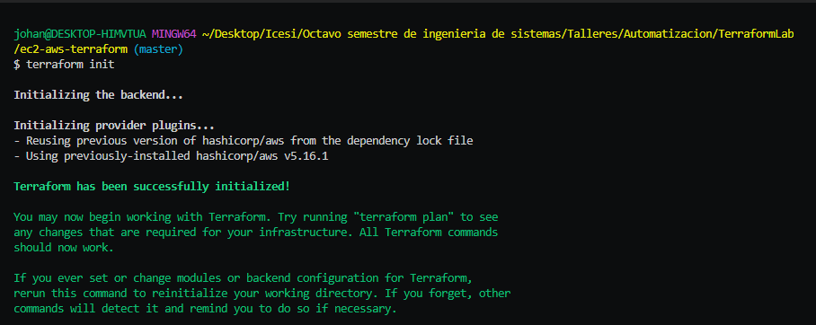

**terraform plan**

 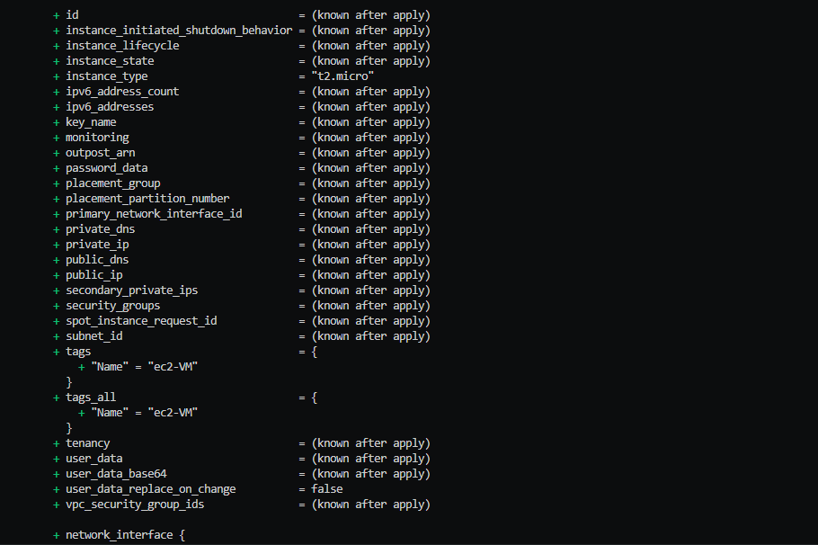 
 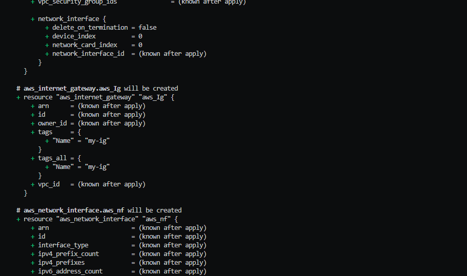 
 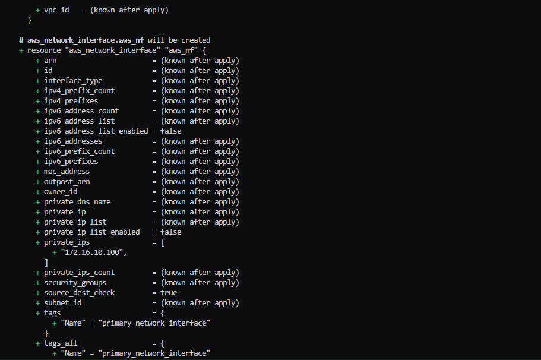 
 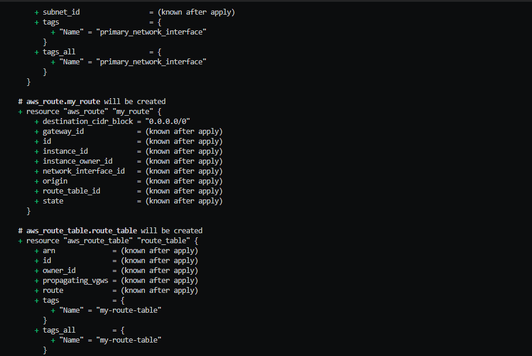 
 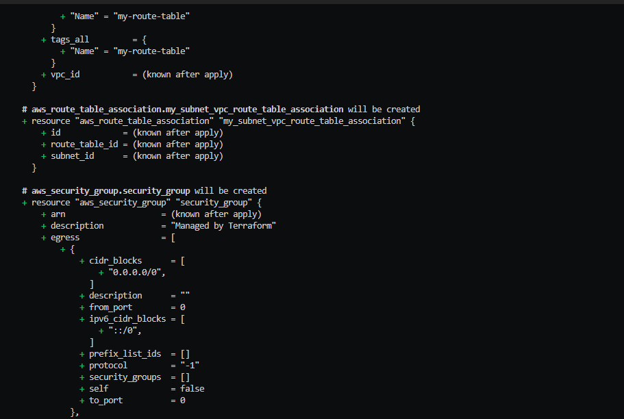 
 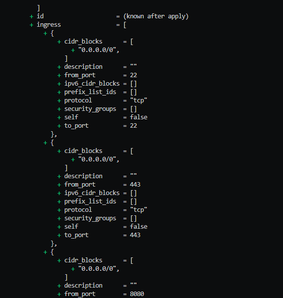 
 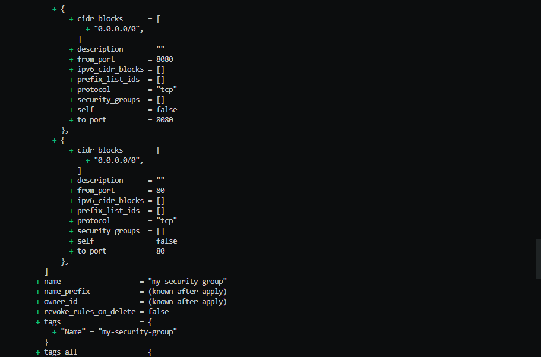 
 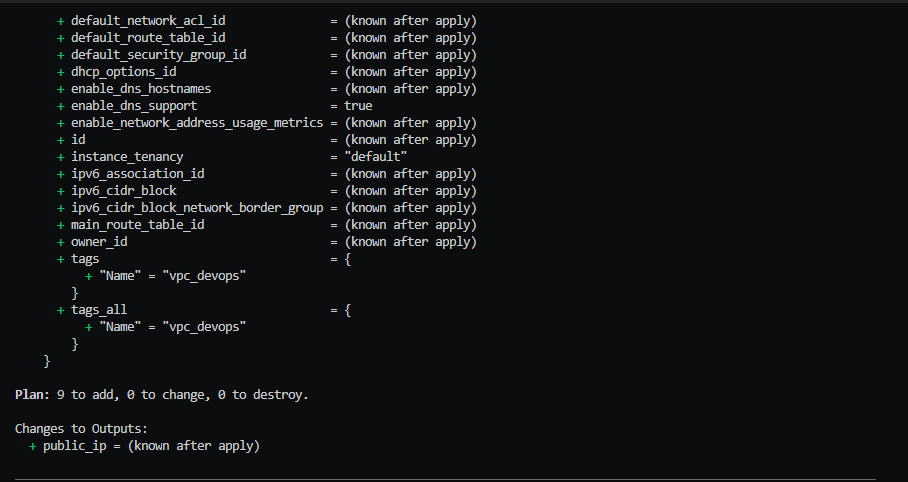


**terraform apply**

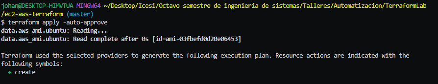 
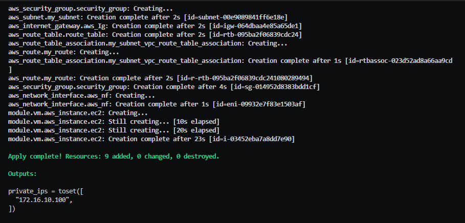


## Look at the results in AWS ❄️

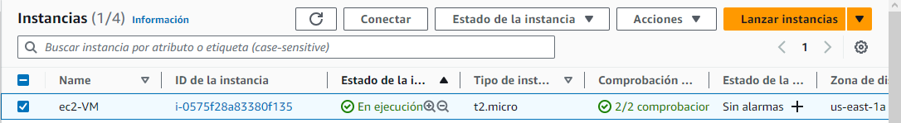 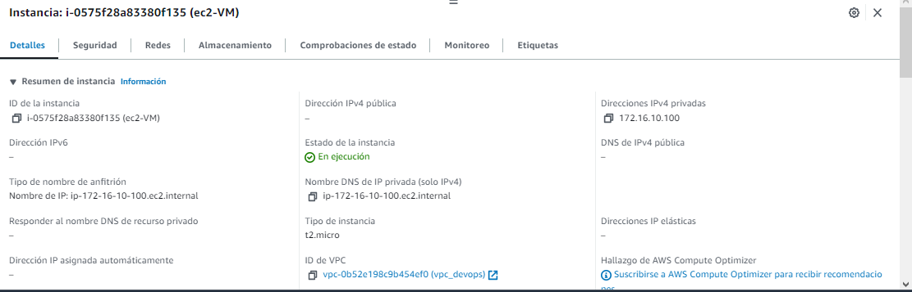 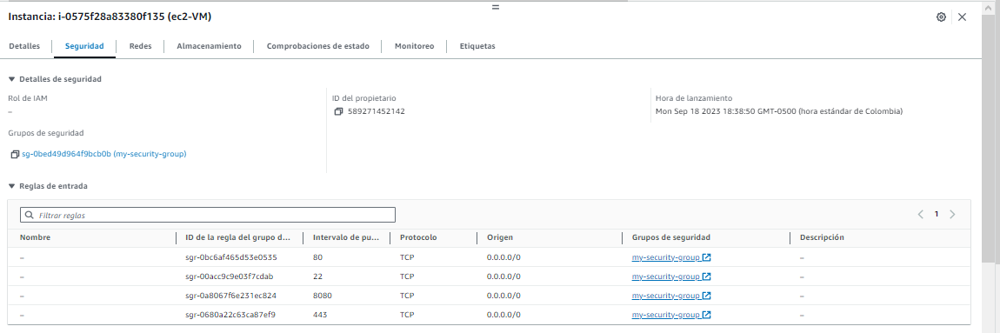 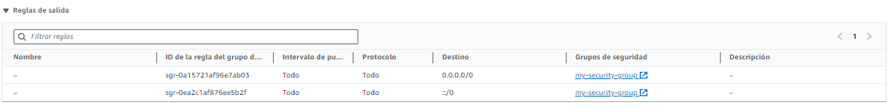 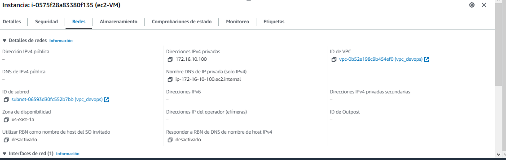
